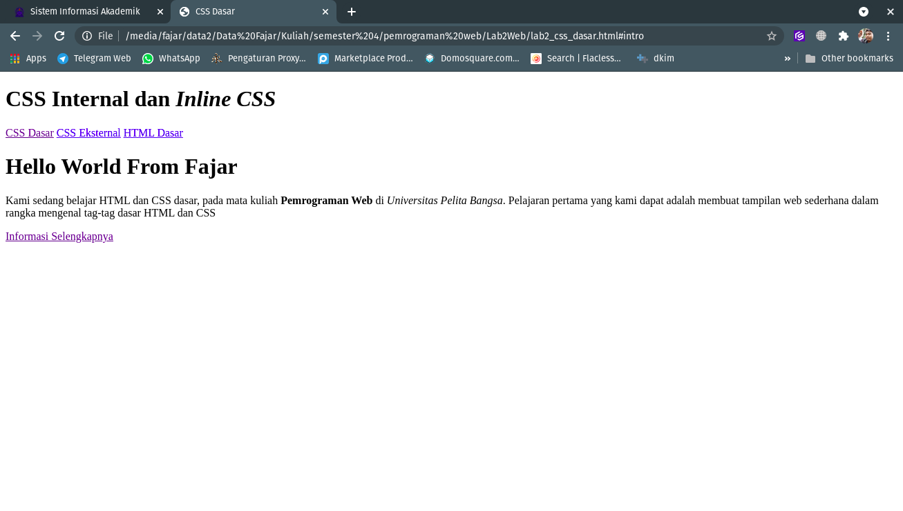
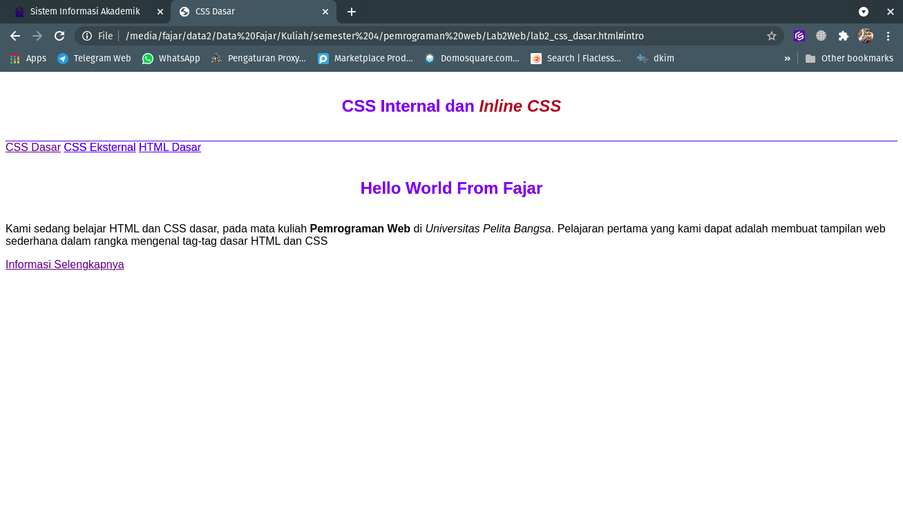
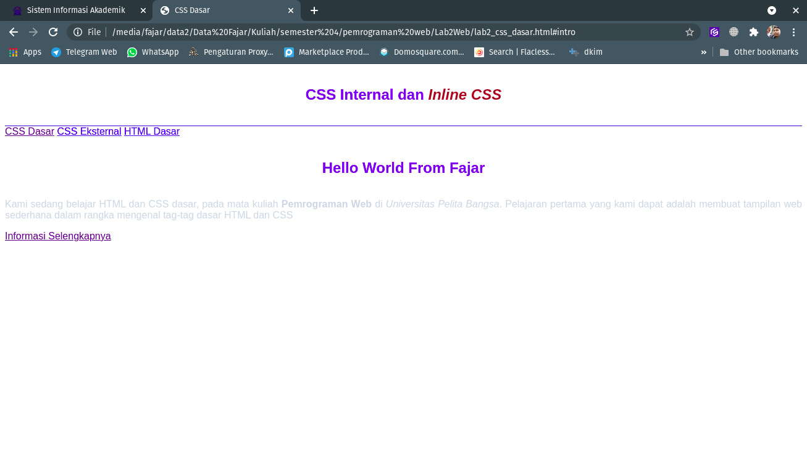
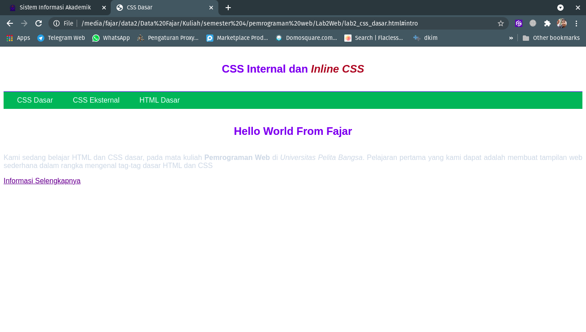
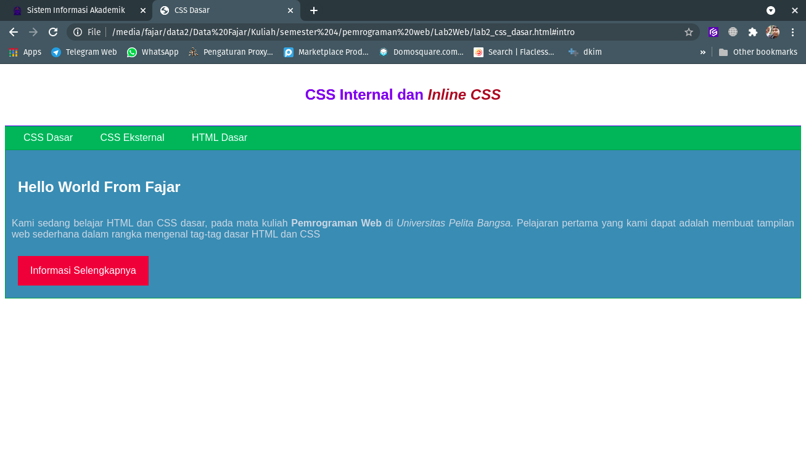
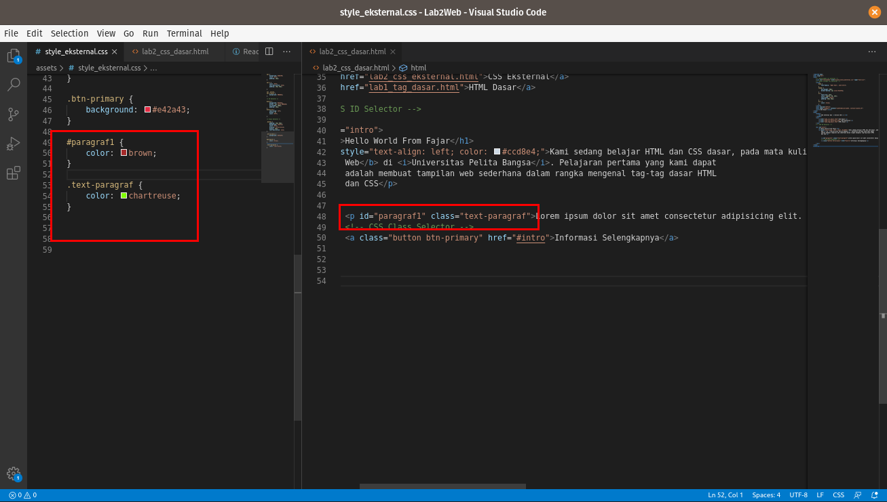
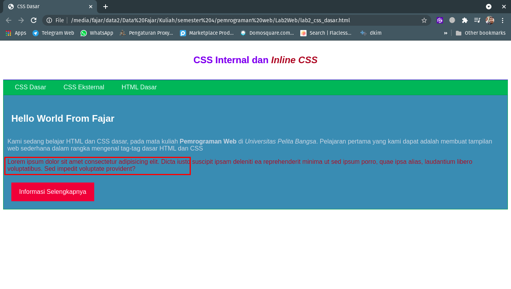

# Lab2Web

Fajar Arif Riyanto  
311910666  
TI 19 B2

1. Membuat HTML Dasar pada VS Code  
     

2. Mendeklarasikan CSS Internal didalam file html dan berikut hasil nya
    

3. Menambahkan inline css pada tag 'p' di file html.
    

4. Membuat file css eksternal pada directory assets. lalu menambahkan tag link yang mengarah pada file eksternal css tersebut.
     

5. Menambahkan File selector pada file css sehingga menampilkan hasil sebagai berikut.
    

**Jawaban Pertanyaan dan Tugas**

1. perbedaan pendeklarasian CSS elemen h1 {...} dengan #intro h1 {...}  

| h1 {...}  | #intro h1 {...} |
| ----- | --- |
|   Deklarasi ini akan merubah semua elemen "h1" | deklarasi ini lebih spesifik, maksud nya adalah yang akan mendapat atribut adalah elemen "h1" dengan id "intro"   |

2. Apabila ada deklarasi CSS secara internal, lalu ditambahkan CSS eksternal dan inline CSS pada
elemen yang sama. Deklarasi manakah yang akan ditampilkan pada browser?  
    jawaban nya adalah deklarasi inline yang akan di tampilkan pada browser.

3. Pada sebuah elemen HTML terdapat ID dan Class, apabila masing-masing selector tersebut
terdapat deklarasi CSS, maka deklarasi manakah yang akan ditampilkan pada browser?  
    jawaban nya adalah class ID yang akan di tampilkan pada browser karena class id secara individu mewakili sebua atribut.
    Contoh nya bisa di lihat pada 2 gambar di bawah ini terdapat sebuah paragraf dengan class dan id, saat di running di browser yang di tampikan adalah atribut id:
  

